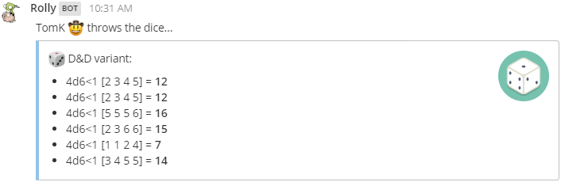

# ca.taffer.mm-rolly

Dice rolling plugin for Mattermost.

Inspired by
[moussetc/mattermost-plugin-dice-roller](https://github.com/moussetc/mattermost-plugin-dice-roller)
and [DiceBot](https://dice-b.appspot.com/) for Slack.

Note that I don't actually know Go, so this could be rough...

## Rolling Dice

Support "any" [reasonable](https://en.wikipedia.org/wiki/Dice_notation) dice
rolling request:

* *x*d*y* or *x*D*y* to roll a *y* sided die *x* times
* modifiers: *x*d*y*+*z* (supported modifiers: +, -, x or *, /)
* exploding dice (for every max value, roll and add): *x*d*y*!
* *x*d% - same as *x*d100
* *x*dF - roll
  [FUDGE](https://en.wikipedia.org/wiki/Fudge_%28role-playing_game_system%29)
  dice
* *x*d*y*<*z* - discards the lowest *z* rolls (so 4d6<1 would return a value
  between 3 and 18)
* *x*d*y*>*z* - keeps the best *z* rolls (so 4d6>1 would return a value
  between 1 and 6)

If *x* isn't specified, it defaults to 1. If *y* is less than 2, it defaults
to 2. If you specify a modifier, you must also specify a *z* value.

Nerd combos:

* dnd - same as 3d6 six times (standard D&D or Pathfinder)
* dnd+ - same as 4d6<1 six times (common house rule for D&D or Pathfinder)
* open - roll d%, if it's >= 95, roll again and add, repeating if necessary

Number of dice per roll will be limited to 100 so malicious users can't flood
the channel with dice output.

Number of rolls per request (`/roll 1d6 2d6 ... n`) will be limited to 10 so
malicious users can't flood the channel with dice output.

## Credits

* [Mattermost's plugin sample](https://github.com/mattermost/mattermost-plugin-sample)
* Icon from [Nick Roach](http://www.elegantthemes.com/)'s GPL'd
  [Circle Icons](https://www.iconfinder.com/iconsets/circle-icons-1) set.
